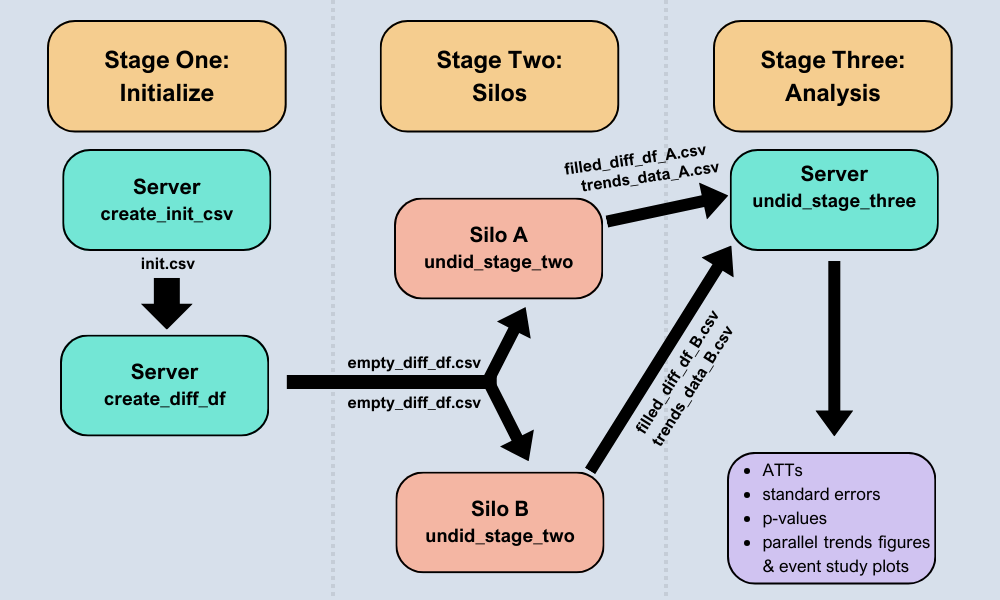
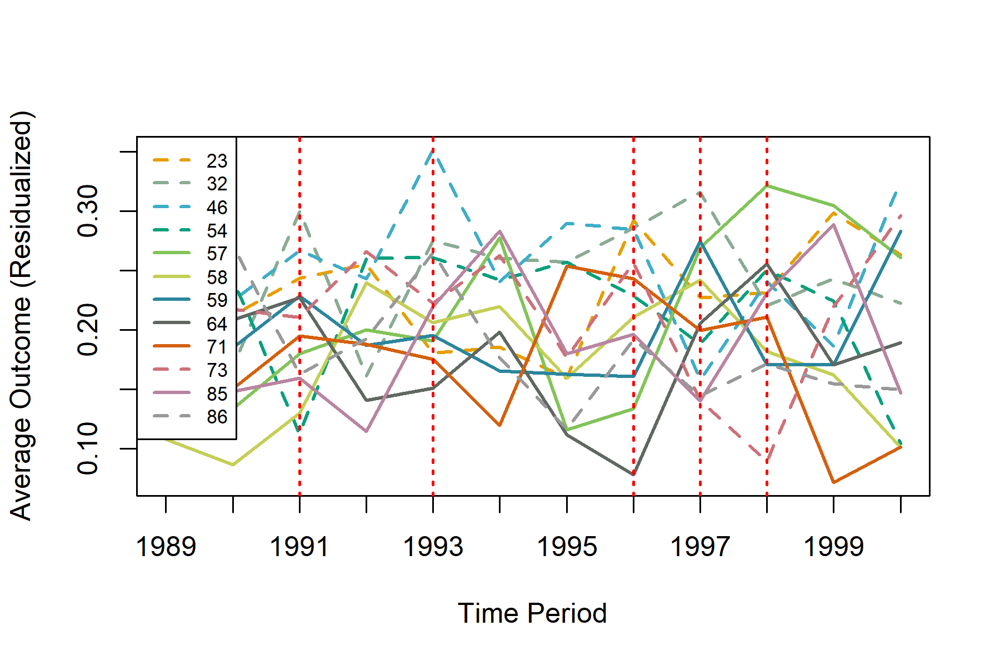
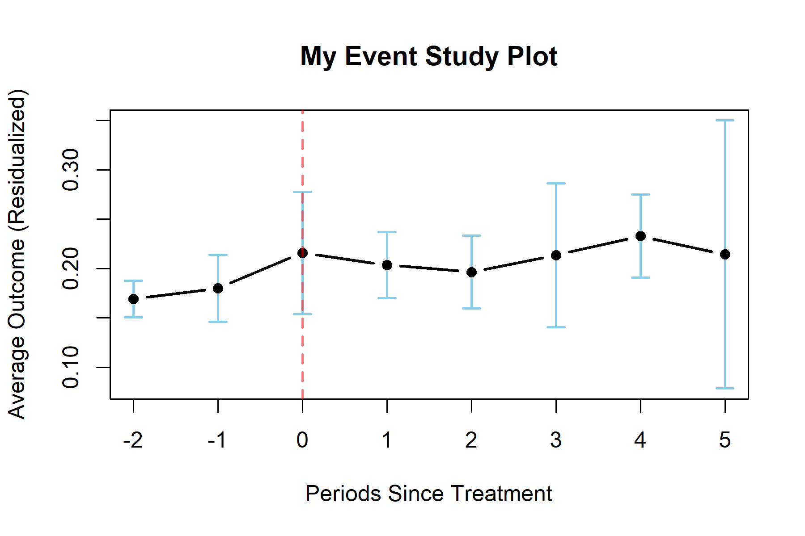

<!-- README.md is generated from README.Rmd. Please edit that file -->

# undidR

<!-- badges: start -->

[](https://github.com/ebjamieson97/undidR/actions/workflows/R-CMD-check.yaml)
[](https://app.codecov.io/gh/ebjamieson97/undidR)
[](https://CRAN.R-project.org/package=undidR)
<!-- badges: end -->

The **undidR** package provides the framework for implementing
difference-in-differences with unpoolable data (UNDID) developed in
[Karim, Webb, Austin, and Strumpf
(2025)](https://arxiv.org/abs/2403.15910v2). UNDID is designed to
estimate the average treatment effect on the treated (ATT) in settings
where data from different silos cannot be pooled together (potentially
for reasons of confidentiality). The package supports both common and
staggered adoption scenarios, as well as the optional inclusion of
covariates. Additionally, **undidR** incorporates a randomization
inference (RI) procedure, based on [MacKinnon and Webb
(2020)](https://doi.org/10.1016/j.jeconom.2020.04.024), for calculating
p-values for the UNDID ATT.

See the image below for an overview of the **undidR** framework:


## Installation

You can install the stable release version of `undidR` from
[CRAN](https://CRAN.R-project.org/package=undidR) with:

``` r
install.packages("undidR")
```

## Examples

For a set of detailed examples see the package vignette using:

``` r
vignette("undidR", package = "undidR")
```

The following code chunks show some basic examples of using **undidR**
at each of its three stages.

### Stage One: `create_init_csv()` & `create_diff_df()`

``` r
library(undidR)
init <- create_init_csv(silo_names = c("73", "46", "54", "23", "86", "32",
                                       "71", "58", "64", "59", "85", "57"),
                        start_times = "1989",
                        end_times = "2000",
                        treatment_times = c(rep("control", 6),
                                            "1991", "1993", "1996", "1997",
                                            "1997", "1998"))
#> init.csv saved to: C:/Users/Eric Bruce Jamieson/AppData/Local/Temp/RtmpAluOGo/init.csv
init
#>    silo_name start_time end_time treatment_time
#> 1         73       1989     2000        control
#> 2         46       1989     2000        control
#> 3         54       1989     2000        control
#> 4         23       1989     2000        control
#> 5         86       1989     2000        control
#> 6         32       1989     2000        control
#> 7         71       1989     2000           1991
#> 8         58       1989     2000           1993
#> 9         64       1989     2000           1996
#> 10        59       1989     2000           1997
#> 11        85       1989     2000           1997
#> 12        57       1989     2000           1998

init_filepath <- normalizePath(file.path(tempdir(), "init.csv"),
                               winslash = "/", mustWork = FALSE)
empty_diff_df <- create_diff_df(init_filepath, date_format = "yyyy",
                                freq = "yearly",
                                covariates = c("asian", "black", "male"))
#> empty_diff_df.csv saved to: C:/Users/Eric Bruce Jamieson/AppData/Local/Temp/RtmpAluOGo/empty_diff_df.csv
head(empty_diff_df, 4)
#>   silo_name gvar treat diff_times        gt RI start_time end_time weights
#> 1        73 1991     0  1991;1990 1991;1991  0       1989     2000    both
#> 2        73 1991     0  1992;1990 1991;1992  0       1989     2000    both
#> 3        73 1991     0  1993;1990 1991;1993  0       1989     2000    both
#> 4        73 1991     0  1994;1990 1991;1994  0       1989     2000    both
#>   diff_estimate diff_var diff_estimate_covariates diff_var_covariates
#> 1            NA       NA                       NA                  NA
#> 2            NA       NA                       NA                  NA
#> 3            NA       NA                       NA                  NA
#> 4            NA       NA                       NA                  NA
#>         covariates date_format   freq  n n_t anonymize_size
#> 1 asian;black;male        yyyy 1 year NA  NA             NA
#> 2 asian;black;male        yyyy 1 year NA  NA             NA
#> 3 asian;black;male        yyyy 1 year NA  NA             NA
#> 4 asian;black;male        yyyy 1 year NA  NA             NA
```

### Stage Two: `undid_stage_two()`

``` r
silo_data <- silo71
empty_diff_filepath <- system.file("extdata/staggered", "empty_diff_df.csv",
                                   package = "undidR")
stage2 <- undid_stage_two(empty_diff_filepath, silo_name = "71",
                          silo_df = silo_data, time_column = "year",
                          outcome_column = "coll", silo_date_format = "yyyy")
#> filled_diff_df_71.csv saved to: C:/Users/Eric Bruce Jamieson/AppData/Local/Temp/RtmpAluOGo/filled_diff_df_71.csv
#> trends_data_71.csv saved to: C:/Users/Eric Bruce Jamieson/AppData/Local/Temp/RtmpAluOGo/trends_data_71.csv
head(stage2$diff_df, 4)
#>   silo_name gvar treat diff_times        gt RI start_time end_time weights
#> 1        71 1991     1  1991;1990 1991;1991  0       1989     2000    both
#> 2        71 1991     1  1992;1990 1991;1992  0       1989     2000    both
#> 3        71 1991     1  1993;1990 1991;1993  0       1989     2000    both
#> 4        71 1991     1  1994;1990 1991;1994  0       1989     2000    both
#>   diff_estimate    diff_var diff_estimate_covariates diff_var_covariates
#> 1    0.12916667 0.009655194              0.116348472         0.009930942
#> 2    0.06916667 0.008781435              0.069515594         0.008624581
#> 3    0.02546296 0.008134930              0.005133291         0.008084684
#> 4    0.02703901 0.008748277              0.029958108         0.008704568
#>         covariates date_format   freq   n n_t anonymize_size
#> 1 asian;black;male        yyyy 1 year  93  45             NA
#> 2 asian;black;male        yyyy 1 year  98  50             NA
#> 3 asian;black;male        yyyy 1 year 102  54             NA
#> 4 asian;black;male        yyyy 1 year  95  47             NA
head(stage2$trends_data, 4)
#>   silo_name treatment_time time mean_outcome mean_outcome_residualized
#> 1        71           1991 1989    0.3061224                 0.1998800
#> 2        71           1991 1990    0.2708333                 0.1502040
#> 3        71           1991 1991    0.4000000                 0.1949109
#> 4        71           1991 1992    0.3400000                 0.1876636
#>         covariates date_format   freq  n
#> 1 asian;black;male        yyyy 1 year 49
#> 2 asian;black;male        yyyy 1 year 48
#> 3 asian;black;male        yyyy 1 year 45
#> 4 asian;black;male        yyyy 1 year 50
```

### Stage Three: `undid_stage_three()`

``` r
dir_path <- system.file("extdata/staggered", package = "undidR")
results <- undid_stage_three(dir_path, agg = "g", covariates = TRUE,
                             nperm = 399, hc = "hc0", verbose = NULL)
summary(results)
#> 
#>   Weighting: both
#>   Aggregation: g
#>   Not-yet-treated: FALSE
#>   Covariates: asian, black, male
#>   HCCME: hc0
#>   Period Length: 1 year
#>   First Period: 1989
#>   Last Period: 2000
#>   Permutations: 399
#> 
#> Aggregate Results:
#>        ATT Std. Error    p-value RI p-value Jackknife SE Jackknife p-value
#>  0.0727396 0.02600099 0.04893262 0.05012531   0.03619008        0.06960867
#> 
#> Subaggregate Results:
#> Treatment Time              ATT         SE    p-value   RI p-val      JK SE   JK p-val     Weight
#> -------------------------------------------------------------------------------------------------------------- 
#> 1991                     0.0434     0.0252     0.0899     0.3258         NA         NA     0.2428
#> 1993                     0.0478     0.0242     0.0528     0.4536         NA         NA     0.2305
#> 1996                     0.0451     0.0353     0.2106     0.6065         NA         NA     0.0910
#> 1997                     0.1322     0.0294     0.0001     0.0627     0.0532     0.0302     0.3863
#> 1998                    -0.0812     0.0602     0.1937     0.2657         NA         NA     0.0494
```

``` r
plot(results, lwd = 2, legend = "topleft")
```



The S3 method of `plot()` for an UnDiDObj accepts parameters inherited
from default `plot()` such as `main`, as well as the additional
parameters of: `ci` (confidence interval), `event_window` (periods
before / after treatment to plot), and `event` (TRUE or FALSE to plot
either event study or parallel trends plots).

``` r

plot(results, event = TRUE, ci = 0.9, event_window = c(-2, 5),
     main = "My Event Study Plot", lwd = 2)
```


